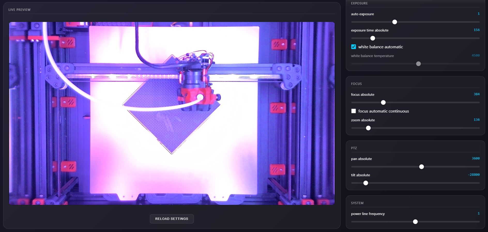

# Klipper Camera Settings Plugin

> [!IMPORTANT]
> **Status: Alpha** - This plugin is in early development.

A simple plugin to control V4L2 camera settings (like focus, exposure, brightness) directly from the detailed Fluidd/Mainsail web interface.



## Installation

1.  Clone or copy this repository to your home directory:
    ```bash
    cd ~
    git clone https://github.com/lunnysteve/Klipper-Camera-Settings.git camera-settings
    ```

2.  Run the installer:
    ```bash
    cd ~/camera-settings
    chmod +x install.sh
    ./install.sh
    ```

3.  Add the include to your `printer.cfg` (if not already present):
    ```ini
    [include camera_ctrl.cfg]
    ```

4.  Restart Klipper.

## Usage

Access the settings dashboard at:
`http://<your-printer-ip>/camera_settings.html`

## Features

-   Real-time control of V4L2 parameters.
-   **Persistent Settings**: Settings are saved and restored on restart.
-   **Sidebar Layout**: 70% camera view + 30% sticky settings panel.
-   **Auto-Refresh**: UI updates automatically when controls interact (e.g. turning off Auto Focus enables the Manual Focus slider).

## Updates

To enable easy updates via Moonraker, add the following to your `moonraker.conf`:

```ini
[update_manager camera-settings]
type: git_repo
path: ~/camera-settings
origin: https://github.com/lunnysteve/Klipper-Camera-Settings.git
primary_branch: main
is_system_service: False
managed_services: klipper
```

## Uninstalling

To uninstall the plugin:

1.  Run the uninstall script:
    ```bash
    cd ~/camera-settings
    ./uninstall.sh
    ```
2.  Remove `[include camera_ctrl.cfg]` from your `printer.cfg`.
3.  Restart Klipper.
